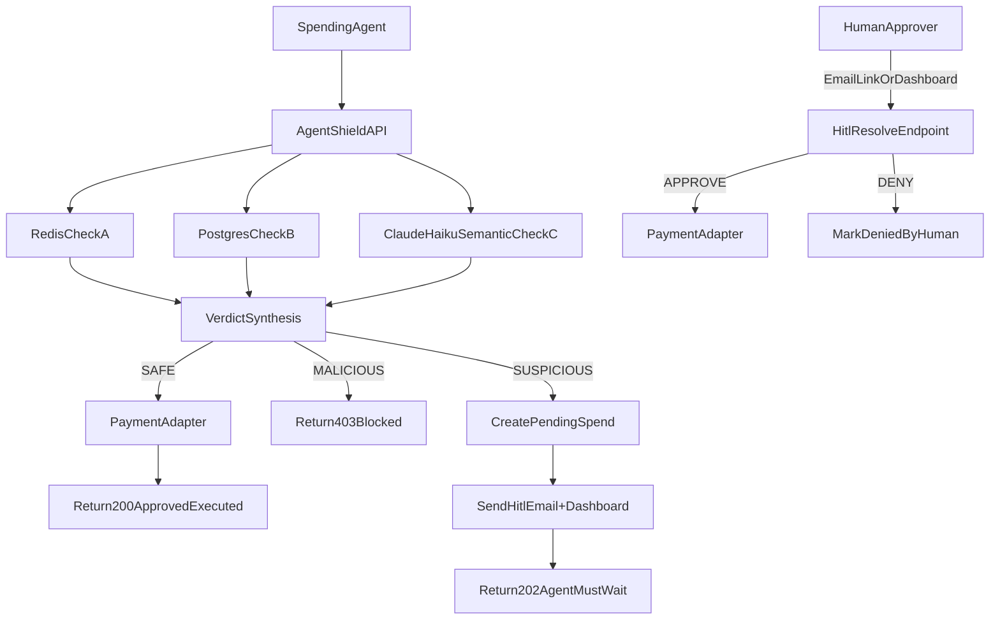

# AgentShield

AI agents are getting real spend authority. AgentShield is the firewall that sits between them and your money.

Built this after my own buying agent tried to make a bad purchase. AgentShield caught it.

It sits between an AI spending agent and payment rails, runs a three-layer risk check, and blocks or escalates anything suspicious before funds move.

**SAFE** → executes immediately. **SUSPICIOUS** → pauses for human review. Agent waits. **MALICIOUS** → blocked.

---

Primary scope in this codebase is **stablecoin spending** (`USDC`/`USDT`) with optional fiat adapter compatibility.

## What This Service Does

- Receives spend intents through `POST /v1/spend-request`
- Runs **Financial Triangulation**:
  - Quantitative checks (Redis)
  - Policy checks (Postgres-backed Agent policy)
  - Semantic checks (Claude Haiku via Anthropic API)
- Produces one of 3 outcomes:
  - `SAFE` -> execute immediately (`200`)
  - `SUSPICIOUS` -> pause for Human-in-the-Loop (`202`)
  - `MALICIOUS` -> block (`403`)
- Resolves paused requests via `POST /v1/hitl/resolve/{request_id}` (email approve/deny links + dashboard)
- Exposes dashboard queue APIs for pending HITL review
- Persists append-only audit records for every decision/execution step

## Architecture Overview

### Trust Boundaries

- **Untrusted input**: autonomous spending-agent requests
- **Controlled decision layer**: FastAPI + policy engine + Redis + Postgres + local SLM
- **External side effects**: payment adapters and HITL notification channel

### Main Components

- **FastAPI API Layer**
  - `app/main.py`
  - `app/api/v1/routes/agents.py`
  - `app/api/v1/routes/spend.py`
  - `app/api/v1/routes/hitl.py`
  - `app/api/v1/routes/dashboard.py`
  - `app/api/v1/routes/onboarding.py`
- **Policy Engine**
  - `app/policy/engine.py`
  - `app/policy/verdicts.py`
  - `app/policy/checks/quantitative.py`
  - `app/policy/checks/policy_db.py`
  - `app/policy/checks/semantic.py`
- **Persistence**
  - Postgres/SQLModel: `app/db/postgres.py`, `app/models/*`
  - Redis: `app/db/redis.py`
- **Stablecoin Policy**
  - `app/services/payment/stablecoin_policy.py` — validates token/network/address against agent policy
- **HITL Services**
  - Email + dashboard notification service: `app/services/hitl/notifier.py`
  - State transitions: `app/services/hitl/state_manager.py`
- **Dashboard Queue**
  - Queue model: `app/models/dashboard_notification.py`
  - Queue APIs: `app/api/v1/routes/dashboard.py`
- **Semantic Check Client**
  - `app/services/slm/client.py` (Anthropic SDK, `claude-haiku-4-5-20251001`)
- **Idempotency + Metrics**
  - `app/services/idempotency.py`
  - `app/core/metrics.py`

### Architecture Sequence

### Decision Matrix

- `SAFE`: all checks clean -> execute payment immediately (`200`)
- `SUSPICIOUS`: soft-risk conditions -> pause and require HITL (`202`)
- `MALICIOUS`: hard-deny condition -> block with no payment execution (`403`)

HITL notification currently uses **email + dashboard**. SMS support is coming soon.

## Financial Triangulation Flow

For each `POST /v1/spend-request`, AgentShield:

1. Validates request + authenticates caller.
2. Loads Agent policy profile.
3. Computes transaction fingerprint.
4. Runs **Check A (Redis Quantitative)**:
   - Daily budget projection
   - Loop pattern detection
   - Destination burst detection
5. Runs **Check B (Policy DB)**:
   - Vendor blocklist
   - Rule-based phishing domain detection (path parameter patterns, random-looking subdomains)
   - Amount over auto-approval threshold
   - Stablecoin token/network/address policy
6. Runs **Check C (Semantic)**:
   - `claude-haiku-4-5-20251001` via Anthropic API classifies goal/vendor/item alignment
   - Returns `ALIGNED`, `WEAK`, or `MISMATCH` label + reason codes
   - Only `MISMATCH` triggers a `SUSPICIOUS` escalation; `WEAK` logs a reason and passes through
   - Obvious phishing domains are hard-denied in Check B before Check C runs
7. Synthesizes verdict:
   - `MALICIOUS` on hard deny conditions
   - `SUSPICIOUS` on soft risk conditions
   - `SAFE` otherwise
8. Branches outcome:
   - `SAFE`: execute payment + commit budget + audit log
   - `MALICIOUS`: block + audit log
   - `SUSPICIOUS`: create pending spend + send HITL email + dashboard notification + return wait response

## Human-in-the-Loop (HITL) Guarantee

If a request is suspicious:

- status becomes `PENDING_HITL`
- payment is **not executed**
- agent receives `202` with `next_action=AGENT_MUST_WAIT`
- human approves/denies via webhook endpoint
- only `APPROVE` triggers payment execution
- `DENY` (or expiration) ends request without payment

This enforces the requirement that the agent must wait for human approval before purchase is allowed.

## API Contracts

### Endpoint Index

- `POST /v1/agents` — register a new agent
- `GET /v1/agents` — list all agents
- `POST /v1/agents/{agent_id}/credentials/hmac/rotate` — rotate HMAC secret
- `POST /v1/spend-request` — submit a spend intent for evaluation
- `POST /v1/hitl/resolve/{request_id}` — approve or deny a pending spend (dashboard/webhook)
- `GET /v1/hitl/email-resolve/{request_id}` — one-click approve/deny from email link
- `GET /v1/dashboard/agents/{agent_id}/notifications?status=OPEN` — HITL queue
- `PATCH /v1/dashboard/agents/{agent_id}/notifications/{notification_id}` — ACK or DISMISS
- `GET /v1/dashboard/agents/{agent_id}/activity` — full audit log with check results
- `GET /v1/dashboard/agents/{agent_id}/stats` — daily transaction counts by outcome
- `POST /v1/onboarding/bootstrap` — one-shot agent setup with quickstart curl
- `GET /v1/onboarding/agents/{agent_id}/checklist` — onboarding progress tracker (fields: `agent_created`, `first_transaction_submitted`, `human_decision_made`, `ready_for_live`)

### 1) `POST /v1/spend-request`

Required core fields:

- `agent_id`
- `declared_goal`
- `amount_cents`
- `currency`
- `vendor_url_or_name`
- `item_description`
- `asset_type` (`STABLECOIN` or `FIAT`)

Stablecoin-required fields:

- `stablecoin_symbol` (`USDC` or `USDT`)
- `network` (`ethereum`, `base`, `solana`, `polygon`, `arbitrum`)
- `destination_address`

Responses:

- `200` approved and executed
- `202` pending HITL
- `403` blocked

Schema source: `app/api/v1/schemas/spend.py`

### 2) `POST /v1/hitl/resolve/{request_id}`

Request:

- `decision` (`APPROVE` or `DENY`)
- `resolver_id`
- `channel` (`dashboard` or `email`)
- optional metadata (`resolution_note`, `provider_message_id`)

Response includes resolution status and whether payment was executed.

Schema source: `app/api/v1/schemas/hitl.py`

### 3) `GET /v1/hitl/email-resolve/{request_id}`

One-click approve/deny from the email notification link.

- Query params: `decision` (`APPROVE` or `DENY`), `token` (HMAC-signed for link authenticity)
- Returns a confirmation HTML page
- Resolves the same pending request path as the dashboard webhook

> **SMS support is coming soon.** Inbound SMS resolution will be added as an additional HITL channel.

### 4) Dashboard Queue Endpoints

- `GET /v1/dashboard/agents/{agent_id}/notifications?status=OPEN`
  - Returns queue items for the in-app approval dashboard
- `PATCH /v1/dashboard/agents/{agent_id}/notifications/{notification_id}`
  - Body action: `ACK` or `DISMISS`
  - Marks notification for operator workflow state

## Data Models

### Postgres Tables (SQLModel)

- `Agent` (`app/models/agent.py`)
  - Budget thresholds, blocked vendors, stablecoin policies
- `SpendAuditLog` (`app/models/spend_audit_log.py`)
  - Ledger of checks/verdicts/execution metadata; HITL resolution updates the existing row in place (approve/deny transitions status rather than inserting a new row)
- `PendingSpend` (`app/models/pending_spend.py`)
  - Paused requests awaiting human decision
- `DashboardNotification` (`app/models/dashboard_notification.py`)
  - HITL queue visible to ops dashboard; tracks OPEN/ACKED/RESOLVED/DISMISSED state

Migration artifacts:

- `app/migrations/versions/20260418_0001_initial_schema.py` — initial schema
- `app/migrations/versions/20260420_0002_agent_hmac_secret.py` — adds HMAC secret fields to Agent

### Redis Keys

- Daily budget:
  - `budget:daily:{agent_id}:{asset_type}:{yyyy-mm-dd}`
- Idempotency cache:
  - `idempotency:{agent_id}:{idempotency_key}`
- Loop detection:
  - `loop:txn:{agent_id}:{fingerprint}`
- Destination burst:
  - `dest:burst:{agent_id}:{network}:{destination_address}`

## Security + Reliability Notes

- Production auth verification is implemented in `app/core/security.py`:
  - HMAC signed agent requests (`x-agent-id`, `x-timestamp`, `x-signature`)
  - HMAC signed webhook requests (`x-webhook-timestamp`, `x-webhook-signature`)
- Signature replay protection enforced with timestamp tolerance (`SIGNATURE_TOLERANCE_SECONDS`)
- Idempotency support prevents duplicate request execution
- Request tracing middleware injects:
  - `x-request-id`
  - `x-latency-ms`
- Lightweight in-process metrics counters in `app/core/metrics.py`
- Audit ledger includes stablecoin execution fields (`network`, `destination_address`, `onchain_tx_hash`)

## Local Development

## Prerequisites

- Python `3.11+`
- Docker

## Setup

1. Copy env template and fill in secrets:
   - `cp .env.example .env`
   - Set `ANTHROPIC_API_KEY`, `SENDGRID_API_KEY`, `AGENT_HMAC_SECRET`, `WEBHOOK_HMAC_SECRET`
2. Install dependencies (uses `uv`):
   - `uv sync`
3. Start infra (Postgres + Redis):
   - `docker compose -f infra/docker-compose.yml up -d`
4. Run migrations:
   - `uv run alembic upgrade head`
5. Run API:
   - `uv run uvicorn app.main:app --reload --port 8000`
6. Run dashboard:
   - `cd dashboard && npm install && npm run dev`
   - Dashboard available at `http://localhost:5173`

## Authentication and Signature Settings

Configure these values in `.env` for production:

- `ANTHROPIC_API_KEY` — Claude Haiku semantic check
- `AGENT_HMAC_SECRET`
- `WEBHOOK_HMAC_SECRET`
- `SIGNATURE_TOLERANCE_SECONDS`
- `SENDGRID_API_KEY` — email HITL notifications
- `HITL_EMAIL_FROM` / `HITL_EMAIL_TO`
- `API_PUBLIC_URL` — public base URL for email approve/deny links (ngrok tunnel in dev)

Canonical HMAC message format used by the API:

- Agent request signatures:
  - `<METHOD>\\n<PATH>\\n<TIMESTAMP_ISO8601>\\n<SHA256_BODY_HEX>\\n<AGENT_ID>`
- HITL webhook signatures:
  - `<METHOD>\\n<PATH>\\n<TIMESTAMP_ISO8601>\\n<SHA256_BODY_HEX>`

## Infra Services (`infra/docker-compose.yml`)

- Postgres on `localhost:5432`
- Redis on `localhost:6379`

## Testing

Run all tests:

- `python3.11 -m pytest`

Current suite:

- Unit tests: policy checks
- Integration tests: SAFE / SUSPICIOUS→APPROVE / MALICIOUS flows
- Integration tests: dashboard queue list/ack behavior
- E2E contract-shape tests for schemas

## Database Migrations (Alembic)

Alembic is fully wired in this repository and reads runtime DB config from `app/core/config.py`.

Core files:

- `alembic.ini`
- `app/migrations/env.py`
- `app/migrations/script.py.mako`
- `app/migrations/versions/20260418_0001_initial_schema.py`
- `scripts/migrate.py`

Common commands:

- Apply migrations:
  - `uv run python3 scripts/migrate.py upgrade head`
- Show current revision:
  - `uv run python3 scripts/migrate.py current`
- Create migration from model changes:
  - `uv run python3 scripts/migrate.py revision --autogenerate --message "your change"`
- Roll back one revision:
  - `uv run python3 scripts/migrate.py downgrade -1`

## What Is Working

- **Spend request pipeline** — full triangulation (Check A + B + C) on every request
- **Verdicts** — SAFE (200), SUSPICIOUS (202), MALICIOUS (403) all firing correctly
- **Check A — Quantitative** — daily budget, loop detection, destination burst (Redis)
- **Check B — Policy** — vendor blocklist, rule-based phishing domain detection, token/network allowlist
- **Check C — Semantic** — `claude-haiku-4-5-20251001` via Anthropic API; `MISMATCH` → SUSPICIOUS, `WEAK` → passes with reason logged
- **HITL dashboard** — pending approvals queue, approve/deny in-app, audit log updates in place
- **HITL email** — SendGrid sends approve/deny links on SUSPICIOUS; links work from phone via ngrok tunnel
- **Dev semantic preset** — `dev_slm_preset: "ALIGNED" | "WEAK" | "MISMATCH"` in request body bypasses Claude in `APP_ENV=dev`
- **Quickstart buttons** — Run SAFE Test and Run HITL Test in the dashboard use dev preset, respond immediately
- **Activity feed** — full audit log with Check A/B/C detail panel per transaction
- **Overview chart** — request activity by time bucket (safe/pending/blocked lines)
- **Stats cards** — today's totals for transactions, blocked, pending, approved (includes human-approved)
- **Onboarding checklist** — tracks agent created, first transaction, first human decision, ready for live
- **HMAC auth** — per-agent signed requests with per-agent secrets stored in dashboard localStorage
- **Idempotency** — Redis-cached responses prevent duplicate payment execution

