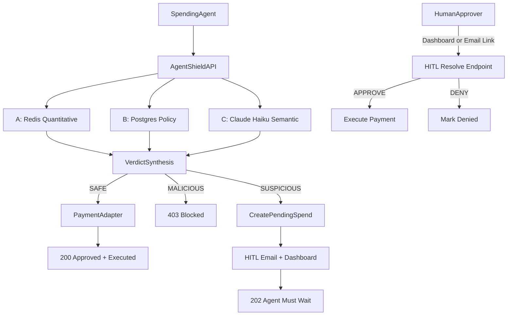

# AgentShield

A spending firewall for autonomous AI agents. Before an agent executes a payment, it submits a spend intent to AgentShield. The system runs three parallel risk checks (Financial Triangulation), produces a verdict, and either executes the payment, holds it for human review, or blocks it entirely.

Built after a buying agent tried to make a bad purchase. AgentShield caught it.

**SAFE** → execute immediately (`200`). **SUSPICIOUS** → pause for human review, agent waits (`202`). **MALICIOUS** → blocked (`403`).

Primary scope: **stablecoin spending** (`USDC`/`USDT`) with optional fiat adapter compatibility.

---

## How It Works

For every `POST /v1/spend-request`, AgentShield runs **Financial Triangulation** — three independent risk checks run in parallel:

| Check | Engine | What It Catches |
|---|---|---|
| **A — Quantitative** | Redis | Daily budget overruns, transaction loop patterns, destination address burst |
| **B — Policy** | Postgres (Agent record) | Vendor blocklist, amount-over-threshold, stablecoin token/network/address policy, phishing domain rules |
| **C — Semantic** | Claude Haiku (Anthropic API) | Goal/vendor/item misalignment, suspicious domain classification |

Verdict synthesis: any hard-deny → `MALICIOUS`; any soft-risk → `SUSPICIOUS`; else → `SAFE`.



---

## Stack

**Backend:** Python 3.11+, FastAPI, SQLModel, Alembic, PostgreSQL, Redis, `uv`

**Semantic check:** `claude-haiku-4-5-20251001` via Anthropic API — classifies goal/vendor/item alignment as `ALIGNED`, `WEAK`, or `MISMATCH`

**HITL notifications:** SendGrid email (approve/deny links) + in-app dashboard queue

**Dashboard:** React + Vite + Tailwind, served separately on port 5173

**Auth:** Per-agent HMAC-SHA256 signed requests; Auth0 JWT for dashboard users; dev legacy key bypass

---

## Local Development

### Prerequisites

- Python 3.11+
- Docker
- Node.js (for dashboard)

### Setup

1. Copy env template and fill in secrets:
   ```sh
   cp .env.example .env
   ```
   Required keys:
   - `ANTHROPIC_API_KEY` — Claude Haiku semantic check
   - `SENDGRID_API_KEY` — HITL email notifications
   - `AGENT_HMAC_SECRET` — per-agent request signing
   - `WEBHOOK_HMAC_SECRET` — HITL resolve webhook signing
   - `API_PUBLIC_URL` — public base URL for email approve/deny links (use ngrok in dev)

2. Install Python dependencies:
   ```sh
   uv sync
   ```

3. Start infrastructure (Postgres + Redis):
   ```sh
   docker compose -f infra/docker-compose.yml up -d
   ```

4. Run database migrations:
   ```sh
   uv run alembic upgrade head
   ```

5. Start the API:
   ```sh
   uv run uvicorn app.main:app --reload --port 8000
   ```

6. Start the dashboard:
   ```sh
   cd dashboard && npm install && npm run dev
   ```
   Dashboard available at `http://localhost:5173`

### Environment Variables

```
APP_ENV=dev                                # dev | prod
POSTGRES_DSN=postgresql+psycopg://...
REDIS_DSN=redis://localhost:6379/0
ANTHROPIC_API_KEY=...                      # required for semantic check
SLM_MODEL_NAME=claude-haiku-4-5-20251001
SENDGRID_API_KEY=...                       # required for HITL email
HITL_EMAIL_FROM=...
HITL_EMAIL_TO=...
API_PUBLIC_URL=http://localhost:8000       # ngrok tunnel in dev
AGENT_HMAC_SECRET=...
WEBHOOK_HMAC_SECRET=...
SIGNATURE_TOLERANCE_SECONDS=300
HITL_DEFAULT_TIMEOUT_SECONDS=600
AUTH0_DOMAIN=...                           # required for dashboard login
AUTH0_AUDIENCE=...
AUTH0_ISSUER=...
```

In `APP_ENV=dev`, requests can use the `x-agent-key: local-dev-key` header to bypass HMAC auth. The `dev_slm_preset` field on spend requests also bypasses the Claude check for fast local testing.

---

## API Reference

### Endpoint Index

| Method | Path | Purpose |
|---|---|---|
| `POST` | `/v1/agents` | Register a new agent |
| `GET` | `/v1/agents` | List all agents |
| `POST` | `/v1/agents/{agent_id}/credentials/hmac/rotate` | Rotate HMAC secret |
| `POST` | `/v1/spend-request` | Submit a spend intent for evaluation |
| `GET` | `/v1/spend-request/{request_id}/status` | Poll status of a pending or resolved request |
| `POST` | `/v1/hitl/resolve/{request_id}` | Approve or deny a pending spend (dashboard/webhook) |
| `GET` | `/v1/hitl/email-resolve/{request_id}` | One-click approve/deny from email link |
| `GET` | `/v1/dashboard/agents/{agent_id}/notifications` | HITL queue (`?status=OPEN`) |
| `PATCH` | `/v1/dashboard/agents/{agent_id}/notifications/{notification_id}` | ACK or DISMISS a notification |
| `GET` | `/v1/dashboard/agents/{agent_id}/activity` | Full audit log with check results |
| `GET` | `/v1/dashboard/agents/{agent_id}/stats` | Daily transaction counts by outcome |
| `POST` | `/v1/onboarding/bootstrap` | One-shot agent setup with quickstart curl |
| `GET` | `/v1/onboarding/agents/{agent_id}/checklist` | Onboarding progress tracker |

---

### `POST /v1/spend-request`

Submits a spend intent for evaluation.

**Request:**

```json
{
  "agent_id": "agt_...",
  "declared_goal": "Book flight JFK to LAX",
  "amount_cents": 25000,
  "currency": "USD",
  "vendor_url_or_name": "delta.com",
  "item_description": "Economy seat JFK-LAX",
  "asset_type": "STABLECOIN",
  "stablecoin_symbol": "USDC",
  "network": "base",
  "destination_address": "0x...",
  "idempotency_key": "optional-dedup-key"
}
```

Stablecoin fields (`stablecoin_symbol`, `network`, `destination_address`) are required when `asset_type` is `STABLECOIN`. Supported networks: `ethereum`, `base`, `solana`, `polygon`, `arbitrum`.

**Responses:**

`200` — SAFE, payment executed:
```json
{
  "request_id": "req_...",
  "status": "APPROVED_EXECUTED",
  "verdict": "SAFE",
  "approved_amount_cents": 25000,
  "currency": "USD",
  "reasons": ["BUDGET_WITHIN_LIMIT", "VENDOR_ALLOWED", "SEMANTIC_ALIGNMENT_HIGH"]
}
```

`202` — SUSPICIOUS, pending human review:
```json
{
  "request_id": "req_...",
  "status": "PENDING_HITL",
  "verdict": "SUSPICIOUS",
  "hitl": {
    "state": "WAITING_HUMAN_REVIEW",
    "channel": "email+dashboard",
    "expires_at": "..."
  },
  "reasons": ["AMOUNT_OVER_AUTO_APPROVAL_THRESHOLD"],
  "next_action": "AGENT_MUST_WAIT"
}
```

`403` — MALICIOUS, blocked:
```json
{
  "request_id": "req_...",
  "status": "BLOCKED",
  "verdict": "MALICIOUS",
  "block_code": "POLICY_HARD_DENY",
  "reasons": ["VENDOR_MATCHED_BLOCKLIST"],
  "next_action": "DO_NOT_RETRY"
}
```

**Dev shortcut:** include `"dev_slm_preset": "ALIGNED" | "WEAK" | "MISMATCH"` in `APP_ENV=dev` to bypass the Claude semantic check.

---

### `POST /v1/hitl/resolve/{request_id}`

Approve or deny a pending spend request.

```json
{
  "decision": "APPROVE",
  "resolver_id": "ops_user_1",
  "channel": "dashboard",
  "resolution_note": "Verified vendor"
}
```

---

### `GET /v1/hitl/email-resolve/{request_id}`

One-click approve/deny from the email link. Query params: `decision` (`APPROVE` or `DENY`), `token` (HMAC-signed for link authenticity). Returns a confirmation HTML page.

---

## Authentication

All auth logic lives in [app/core/security.py](app/core/security.py).

### Agent requests — HMAC-SHA256

The canonical message is 5 lines joined with `\n`:
```
METHOD
/v1/spend-request
<ISO8601 timestamp>
<SHA256 hex of raw request body>
<agent_id>
```

Sign it: `HMAC-SHA256(agent.hmac_secret, canonical_message)`. Send as headers:
- `x-agent-id: agt_...`
- `x-timestamp: 2026-04-25T12:34:56.789Z`
- `x-signature: sha256=<hex>`

The timestamp must be within ±`SIGNATURE_TOLERANCE_SECONDS` (default 300s) of the server clock. This prevents replay attacks. Body hashing prevents payload tampering.

**Python signing example:**
```python
import hashlib, hmac, json
from datetime import datetime, timezone

body = {"agent_id": AGENT_ID, "declared_goal": "...", ...}
body_json = json.dumps(body, separators=(",", ":"))
timestamp = datetime.now(timezone.utc).isoformat()
body_hash = hashlib.sha256(body_json.encode()).hexdigest()
canonical = "\n".join(["POST", "/v1/spend-request", timestamp, body_hash, AGENT_ID])
signature = hmac.new(AGENT_HMAC_SECRET.encode(), canonical.encode(), hashlib.sha256).hexdigest()
```

### HITL webhook — HMAC-SHA256

Same mechanics, but no `agent_id` line (4 lines instead of 5), and uses `WEBHOOK_HMAC_SECRET`. Headers: `x-webhook-timestamp` and `x-webhook-signature`.

### Dev bypass

`APP_ENV=dev` only: send `x-agent-key: local-dev-key` to skip all cryptographic checks.

---

## Financial Triangulation Detail

### Check A — Quantitative (Redis)

```
Daily budget:
  key: budget:daily:{agent_id}:{asset_type}:{YYYY-MM-DD}
  → hard deny if (current + new) > daily_budget_limit_cents

Loop pattern detection:
  fingerprint = SHA256(vendor|amount|item|asset|symbol|network|address)
  key: loop:txn:{agent_id}:{fingerprint}  (TTL: LOOP_WINDOW_SECONDS)
  → suspicious if count >= LOOP_THRESHOLD (default 5)

Destination burst:
  key: dest:burst:{agent_id}:{network}:{address}  (TTL: 60 sec)
  → suspicious if count >= 5
```

### Check B — Policy (Postgres)

```
Vendor blocklist        → hard deny if vendor substring-matches any blocked_vendors
Phishing domain rules   → hard deny on path parameter patterns / random-looking subdomains
Amount threshold        → suspicious if amount > per_txn_auto_approve_limit_cents
Stablecoin rules:
  symbol not in allowed_stablecoins            → hard deny
  network not in allowed_networks              → hard deny
  address in blocked_destination_addresses     → hard deny
  address NOT in allowed_destination_addresses → suspicious (when list non-empty)
```

### Check C — Semantic (Claude Haiku)

Sends `declared_goal`, `amount_cents`, `vendor`, `item`, `stablecoin_symbol`, `network` to `claude-haiku-4-5-20251001`. Returns:

```json
{
  "alignment_label": "ALIGNED | WEAK | MISMATCH",
  "risk_score": 0-100,
  "reason_codes": ["..."]
}
```

Verdict mapping:
- `MISMATCH` or `risk_score >= 85` → hard deny
- `WEAK` or `risk_score >= 50` → suspicious
- Otherwise → pass

If the Anthropic API is unavailable, the check falls back to `WEAK / risk_score=55` (suspicious, never hard block).

---

## Human-in-the-Loop (HITL)

When a request is `SUSPICIOUS`:

1. Status becomes `PENDING_HITL`, payment is **not** executed
2. Agent receives `202` with `next_action: AGENT_MUST_WAIT`
3. HITL notification sent via email (approve/deny links) and dashboard queue
4. Human approves or denies via the dashboard or email link within `HITL_DEFAULT_TIMEOUT_SECONDS` (default 10 min)
5. `APPROVE` → payment executes, audit log updated to `APPROVED_BY_HUMAN_EXECUTED`
6. `DENY` (or expiry) → request ends as `DENIED_BY_HUMAN` or `EXPIRED`, no payment

Agents can poll `GET /v1/spend-request/{request_id}/status` to check resolution.

---

## Dashboard

The React dashboard (`dashboard/`) provides:

- **Agents** — register a new agent, view `agent_id` and HMAC secret, run dev test transactions
- **Overview** — stats cards (transactions today, blocked, pending, approved) + request activity chart
- **Activity** — full audit log with expandable Check A/B/C detail panel per transaction
- **Approvals** — live HITL queue with approve/deny buttons, SLM score bar, Redis/policy signals, countdown timer
- **Integration** — generated Python signing snippet pre-filled with your agent credentials
- **Settings** — HITL preferences (coming soon)

The dashboard auto-refreshes every 2 seconds. HMAC secrets are stored in `localStorage` keyed by `agent_id`.

---

## Data Models

### Postgres (SQLModel)

| Table | Purpose |
|---|---|
| `Agent` | Budget thresholds, blocked vendors, stablecoin policies, HMAC secret |
| `SpendAuditLog` | Append-only ledger; every decision + HITL resolution updates status in place |
| `PendingSpend` | Paused requests awaiting human decision (expires in 10 min) |
| `DashboardNotification` | HITL queue items; states: `OPEN` → `ACKED` / `RESOLVED` / `DISMISSED` |
| `AgentActivity` | Structured event log per agent |
| `User` | Dashboard user accounts |

### Redis Keys

```
budget:daily:{agent_id}:{asset_type}:{YYYY-MM-DD}   → spent_cents, TTL until midnight
loop:txn:{agent_id}:{sha256_fingerprint}             → count, TTL 60s
dest:burst:{agent_id}:{network}:{address}            → count, TTL 60s
idempotency:{agent_id}:{idempotency_key}             → cached response JSON, TTL 24h
```

---

## Database Migrations (Alembic)

```sh
# Apply all migrations
uv run alembic upgrade head

# Show current revision
uv run python3 scripts/migrate.py current

# Create migration from model changes
uv run python3 scripts/migrate.py revision --autogenerate --message "your change"

# Roll back one revision
uv run python3 scripts/migrate.py downgrade -1
```

Migration files are in [app/migrations/versions/](app/migrations/versions/).

---

## Testing

```sh
python3.11 -m pytest
```

Test suite:

- **Unit** — policy check logic (`tests/unit/`)
- **Integration** — SAFE / SUSPICIOUS→APPROVE / MALICIOUS flows; dashboard queue list/ack behavior; HITL spend flow (`tests/integration/`)
- **E2E** — API contract shape tests (`tests/e2e/`)

---

## Security Notes

- HMAC signature replay protection via timestamp tolerance (`SIGNATURE_TOLERANCE_SECONDS`)
- Idempotency cache prevents duplicate payment execution on retried requests
- Budget is only committed on successful payment execution — pending and denied transactions don't consume budget
- Vendor matching is substring-based (`"bad"` in blocklist matches `"badmarket.com"`)
- No HMAC rotation grace period — old secret is immediately invalid on rotation
- Request tracing middleware injects `x-request-id` and `x-latency-ms` on all responses
- In-process metrics counters in [app/core/metrics.py](app/core/metrics.py)
