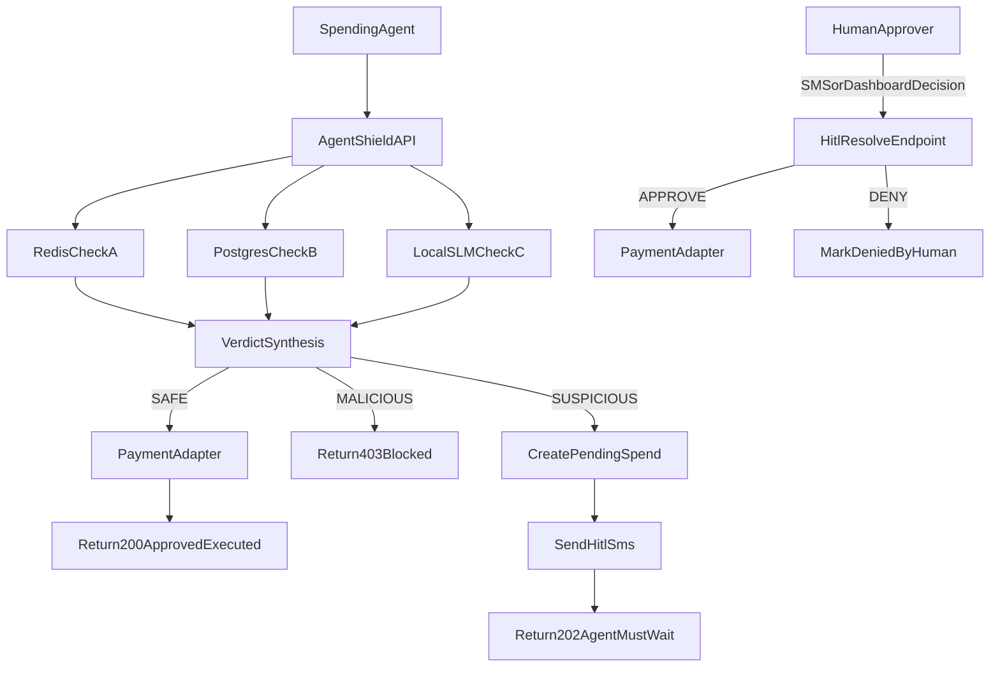

# AgentShield

AgentShield is a **spending firewall for autonomous agents**.  
It sits between an AI spending agent and payment rails, runs deterministic risk checks, and only allows money movement when policy is satisfied.

Primary scope in this codebase is **stablecoin spending** (`USDC`/`USDT`) with optional fiat adapter compatibility.

## What This Service Does

- Receives spend intents through `POST /v1/spend-request`
- Supports user-entered phone verification via OTP before SMS fallback is enabled
- Runs **Financial Triangulation**:
  - Quantitative checks (Redis)
  - Policy checks (Postgres-backed Agent policy)
  - Semantic checks (local SLM over direct HTTP)
- Produces one of 3 outcomes:
  - `SAFE` -> execute immediately (`200`)
  - `SUSPICIOUS` -> pause for Human-in-the-Loop (`202`)
  - `MALICIOUS` -> block (`403`)
- Resolves paused requests via `POST /v1/hitl/resolve/{request_id}`
- Accepts inbound SMS decisions via `POST /v1/hitl/sms/inbound`
- Exposes dashboard queue APIs for pending HITL review
- Persists append-only audit records for every decision/execution step

## Architecture Overview

### Trust Boundaries

- **Untrusted input**: autonomous spending-agent requests
- **Controlled decision layer**: FastAPI + policy engine + Redis + Postgres + local SLM
- **External side effects**: payment adapters and HITL notification channel

### Main Components

- **FastAPI API Layer**
  - `app/main.py`
  - `app/api/v1/routes/agents.py`
  - `app/api/v1/routes/contact.py`
  - `app/api/v1/routes/spend.py`
  - `app/api/v1/routes/hitl.py`
  - `app/api/v1/routes/dashboard.py`
  - `app/api/v1/routes/onboarding.py`
- **Policy Engine**
  - `app/policy/engine.py`
  - `app/policy/verdicts.py`
  - `app/policy/checks/quantitative.py`
  - `app/policy/checks/policy_db.py`
  - `app/policy/checks/semantic.py`
- **Persistence**
  - Postgres/SQLModel: `app/db/postgres.py`, `app/models/*`
  - Redis: `app/db/redis.py`
- **Payment Adapters**
  - Base interface: `app/services/payment/adapter_base.py`
  - Stablecoin execution: `app/services/payment/tempo_adapter.py`
  - Optional fiat execution: `app/services/payment/stripe_adapter.py`
  - Stablecoin policy validation: `app/services/payment/stablecoin_policy.py`
- **HITL Services**
  - Provider-agnostic stub notification service: `app/services/hitl/notifier.py`
  - Inbound text parser: `app/services/hitl/sms_parser.py`
  - OTP generation/verification service: `app/services/hitl/otp.py`
  - State transitions: `app/services/hitl/state_manager.py`
- **Dashboard Queue**
  - Queue model: `app/models/dashboard_notification.py`
  - Queue APIs: `app/api/v1/routes/dashboard.py`
- **SLM Client**
  - `app/services/slm/client.py` (direct HTTP, no LangChain)
- **Idempotency + Metrics**
  - `app/services/idempotency.py`
  - `app/core/metrics.py`

### Architecture Sequence

### Decision Matrix

- `SAFE`: all checks clean -> execute payment immediately (`200`)
- `SUSPICIOUS`: soft-risk conditions -> pause and require HITL (`202`)
- `MALICIOUS`: hard-deny condition -> block with no payment execution (`403`)

HITL policy defaults in code:

- Primary channel is `dashboard`
- SMS is fallback-only for high-risk suspicious events
- SMS fallback is used only when phone is verified

## Financial Triangulation Flow

For each `POST /v1/spend-request`, AgentShield:

1. Validates request + authenticates caller.
2. Loads Agent policy profile.
3. Computes transaction fingerprint.
4. Runs **Check A (Redis Quantitative)**:
   - Daily budget projection
   - Loop pattern detection
   - Destination burst detection
5. Runs **Check B (Policy DB)**:
   - Vendor blocklist
   - Amount over auto-approval threshold
   - Stablecoin token/network/address policy
6. Runs **Check C (SLM Semantic)**:
   - Goal/action alignment score and reason codes
7. Synthesizes verdict:
   - `MALICIOUS` on hard deny conditions
   - `SUSPICIOUS` on soft risk conditions
   - `SAFE` otherwise
8. Branches outcome:
   - `SAFE`: execute payment + commit budget + audit log
   - `MALICIOUS`: block + audit log
   - `SUSPICIOUS`: create pending spend + send HITL text + return wait response

## Human-in-the-Loop (HITL) Guarantee

If a request is suspicious:

- status becomes `PENDING_HITL`
- payment is **not executed**
- agent receives `202` with `next_action=AGENT_MUST_WAIT`
- human approves/denies via webhook endpoint
- only `APPROVE` triggers payment execution
- `DENY` (or expiration) ends request without payment

This enforces the requirement that the agent must wait for human text approval before purchase is allowed.

### Phone Verification Flow (OTP)

To support UI-driven phone onboarding:

1. `POST /v1/agents/{agent_id}/contact/phone/start`
   - Body: `phone_number` (E.164)
   - Generates OTP and sends through configured provider path (stub logger in current build)
2. `POST /v1/agents/{agent_id}/contact/phone/verify`
   - Body: `phone_number`, `code`
   - Stores verified phone on agent profile
3. `PATCH /v1/agents/{agent_id}/preferences/hitl`
   - Controls primary channel and high-risk SMS fallback toggle

## API Contracts

### Endpoint Index

- `POST /v1/agents` — register a new agent
- `GET /v1/agents` — list all agents
- `POST /v1/agents/{agent_id}/credentials/hmac/rotate` — rotate HMAC secret
- `POST /v1/agents/{agent_id}/contact/phone/start` — start OTP phone verification
- `POST /v1/agents/{agent_id}/contact/phone/verify` — confirm OTP
- `PATCH /v1/agents/{agent_id}/preferences/hitl` — update HITL channel preferences
- `POST /v1/spend-request` — submit a spend intent for evaluation
- `POST /v1/hitl/resolve/{request_id}` — approve or deny a pending spend (dashboard/webhook)
- `POST /v1/hitl/sms/inbound` — inbound SMS webhook (Twilio)
- `GET /v1/dashboard/agents/{agent_id}/notifications?status=OPEN` — HITL queue
- `PATCH /v1/dashboard/agents/{agent_id}/notifications/{notification_id}` — ACK or DISMISS
- `GET /v1/dashboard/agents/{agent_id}/activity` — full audit log with check results
- `GET /v1/dashboard/agents/{agent_id}/stats` — daily transaction counts by outcome
- `POST /v1/onboarding/bootstrap` — one-shot agent setup with quickstart curl
- `GET /v1/onboarding/agents/{agent_id}/checklist` — onboarding progress tracker (fields: `agent_created`, `first_transaction_submitted`, `human_decision_made`, `ready_for_live`)

### 1) `POST /v1/spend-request`

Required core fields:

- `agent_id`
- `declared_goal`
- `amount_cents`
- `currency`
- `vendor_url_or_name`
- `item_description`
- `asset_type` (`STABLECOIN` or `FIAT`)

Stablecoin-required fields:

- `stablecoin_symbol` (`USDC` or `USDT`)
- `network` (`ethereum`, `base`, `solana`, `polygon`, `arbitrum`)
- `destination_address`

Responses:

- `200` approved and executed
- `202` pending HITL
- `403` blocked

Schema source: `app/api/v1/schemas/spend.py`

### 2) `POST /v1/hitl/resolve/{request_id}`

Request:

- `decision` (`APPROVE` or `DENY`)
- `resolver_id`
- `channel` (`dashboard` or `sms`)
- optional metadata (`resolution_note`, `provider_message_id`)

Response includes resolution status and whether payment was executed.

Schema source: `app/api/v1/schemas/hitl.py`

### 3) `POST /v1/hitl/sms/inbound`

Inbound webhook for SMS providers (provider-agnostic parser endpoint).

- Expected message format:
  - `APPROVE <request_id>`
  - `DENY <request_id>`
- Validates sender phone against `PendingSpend.hitl_contact`
- On valid decision, resolves the same pending request path as dashboard/webhook resolution
- Responds with XML confirmation/error text

### 4) Dashboard Queue Endpoints

- `GET /v1/dashboard/agents/{agent_id}/notifications?status=OPEN`
  - Returns queue items for the in-app approval dashboard
- `PATCH /v1/dashboard/agents/{agent_id}/notifications/{notification_id}`
  - Body action: `ACK` or `DISMISS`
  - Marks notification for operator workflow state

### 5) Contact and HITL Preference Endpoints

- `POST /v1/agents/{agent_id}/contact/phone/start`
  - Starts OTP verification for a user-entered phone number
  - Requires authenticated agent scope match
- `POST /v1/agents/{agent_id}/contact/phone/verify`
  - Verifies OTP and stores `hitl_phone_number` + `hitl_phone_verified_at`
- `PATCH /v1/agents/{agent_id}/preferences/hitl`
  - Updates:
    - `hitl_primary_channel` (currently `dashboard`)
    - `hitl_sms_fallback_high_risk` (bool)

## Data Models

### Postgres Tables (SQLModel)

- `Agent` (`app/models/agent.py`)
  - Budget thresholds, blocked vendors, stablecoin policies, HITL contact
- `SpendAuditLog` (`app/models/spend_audit_log.py`)
  - Append-only ledger of checks/verdicts/execution metadata
- `PendingSpend` (`app/models/pending_spend.py`)
  - Paused requests awaiting human decision
- `DashboardNotification` (`app/models/dashboard_notification.py`)
  - HITL queue visible to ops dashboard; tracks OPEN/ACKED/RESOLVED/DISMISSED state

Migration artifacts:

- `app/migrations/versions/20260418_0001_initial_schema.py` — initial schema
- `app/migrations/versions/20260420_0002_agent_hmac_secret.py` — adds HMAC secret fields to Agent

### Redis Keys

- Daily budget:
  - `budget:daily:{agent_id}:{asset_type}:{yyyy-mm-dd}`
- Idempotency cache:
  - `idempotency:{agent_id}:{idempotency_key}`
- Loop detection:
  - `loop:txn:{agent_id}:{fingerprint}`
- Destination burst:
  - `dest:burst:{agent_id}:{network}:{destination_address}`

## Security + Reliability Notes

- Production auth verification is implemented in `app/core/security.py`:
  - Bearer JWT (`Authorization: Bearer <token>`)
  - HMAC signed agent requests (`x-agent-id`, `x-timestamp`, `x-signature`)
  - HMAC signed webhook requests (`x-webhook-timestamp`, `x-webhook-signature`)
- Signature replay protection enforced with timestamp tolerance (`SIGNATURE_TOLERANCE_SECONDS`)
- Idempotency support prevents duplicate request execution
- Request tracing middleware injects:
  - `x-request-id`
  - `x-latency-ms`
- Lightweight in-process metrics counters in `app/core/metrics.py`
- Audit ledger includes stablecoin execution fields (`network`, `destination_address`, `onchain_tx_hash`)

## Local Development

## Prerequisites

- Python `3.11+`
- Docker

## Setup

1. Copy env template:
   - `cp .env.example .env`
2. Install dependencies:
   - `python3.11 -m pip install -e ".[dev]"`
3. Start infra:
   - `docker compose -f infra/docker-compose.yml up -d`
4. Run API:
   - `uvicorn app.main:app --reload`

## Authentication and Signature Settings

Configure these values in `.env` for production:

- `JWT_ALGORITHM`
- `JWT_SECRET`
- `JWT_AUDIENCE`
- `AGENT_HMAC_SECRET`
- `WEBHOOK_HMAC_SECRET`
- `SIGNATURE_TOLERANCE_SECONDS`
- `SMS_PROVIDER` (`stub`)

Canonical HMAC message format used by the API:

- Agent request signatures:
  - `<METHOD>\\n<PATH>\\n<TIMESTAMP_ISO8601>\\n<SHA256_BODY_HEX>\\n<AGENT_ID>`
- HITL webhook signatures:
  - `<METHOD>\\n<PATH>\\n<TIMESTAMP_ISO8601>\\n<SHA256_BODY_HEX>`

## Infra Services (`infra/docker-compose.yml`)

- Postgres on `localhost:5432`
- Redis on `localhost:6379`
- Ollama-compatible local SLM endpoint on `localhost:11434`

## Testing

Run all tests:

- `python3.11 -m pytest`

Current suite:

- Unit tests: policy checks
- Unit tests: SMS inbound parser
- Integration tests: SAFE / SUSPICIOUS->APPROVE / MALICIOUS flows
- Integration tests: OTP phone verification and HITL preference updates
- Integration tests: dashboard queue list/ack behavior
- E2E contract-shape tests for schemas

## Database Migrations (Alembic)

Alembic is fully wired in this repository and reads runtime DB config from `app/core/config.py`.

Core files:

- `alembic.ini`
- `app/migrations/env.py`
- `app/migrations/script.py.mako`
- `app/migrations/versions/20260418_0001_initial_schema.py`
- `scripts/migrate.py`

Common commands:

- Apply migrations:
  - `python3.11 scripts/migrate.py upgrade head`
- Show current revision:
  - `python3.11 scripts/migrate.py current`
- Create migration from model changes:
  - `python3.11 scripts/migrate.py revision --autogenerate --message "your change"`
- Roll back one revision:
  - `python3.11 scripts/migrate.py downgrade -1`

## Current Implementation Boundaries

- SMS sending is currently a notifier stub (`HitlNotifier`) for easy provider swap.
- SLM integration expects local model endpoint and includes fallback behavior if unavailable.

## Suggested Next Steps

1. Add outbound callback delivery for resolved HITL requests.
2. Export metrics to Prometheus/OpenTelemetry.
3. Add pagination cursors and richer filters for dashboard queue endpoints.

