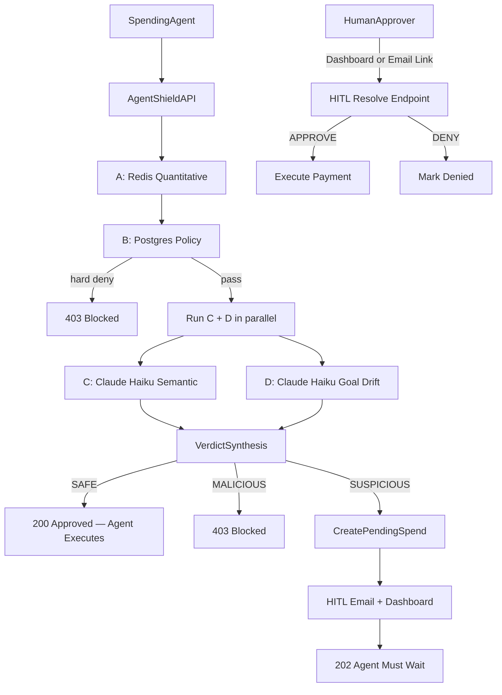

# AgentShield

**[→ Live Dashboard](https://agentshieldv2-dashboard-production.up.railway.app)** — sign in, create an agent, and start making requests in minutes.

Questions or issues → **rizzoluca2003@gmail.com**

> **Early Access** — `SAFE` and `MALICIOUS` verdicts are fully live. The `SUSPICIOUS` / human review flow is functional but still being polished (generalized email sender + SDK polling improvements in progress). Feedback welcome.

---

AgentShield is a spending firewall for AI agents. When an agent wants to make a payment, it has to ask AgentShield first. AgentShield runs four checks on the request and responds with one of three answers:

- **SAFE (`200`)** — cleared, agent may proceed with the payment
- **SUSPICIOUS (`202`)** — something's off, a human needs to review it before anything happens
- **MALICIOUS (`403`)** — blocked, do not retry

The agent never touches the payment directly — it just gets told yes, wait, or no.

Built after a buying agent tried to make a bad purchase.

Primary scope: stablecoin payments (`USDC`/`USDT`) with fiat support available.

## Quick Start (Python SDK)

```bash
pip install agentshield-pythonv2
```

```python
from agentshield import AgentShield, SpendRequest

client = AgentShield(
    agent_id="agt_...",
    hmac_secret="sk_live_...",
    base_url="https://agentshieldv2-backend-production.up.railway.app",
)

result = client.spend_request(SpendRequest(
    agent_id="agt_...",
    declared_goal="Book a flight from JFK to LAX",
    amount_cents=25000,
    currency="USD",
    vendor_url_or_name="delta.com",
    item_description="Economy seat JFK-LAX, Oct 12",
    asset_type="FIAT",
    destination_address="0x742d35Cc6634C0532925a3b8D4C9A6b52E7A1f1",
))

print(result.verdict)  # SAFE | SUSPICIOUS | MALICIOUS
```

Get your `agent_id` and `hmac_secret` from the [dashboard](https://agentshieldv2-dashboard-production.up.railway.app) after creating an agent.

## How It Works

Every spend request goes through four checks. Each check looks at a different dimension of risk:

| Check | Where it runs | What it's checking |
|---|---|---|
| **A — Quantitative** | Redis | Is the agent within its daily budget? Is it sending the same transaction over and over? |
| **B — Policy** | Postgres | Is the vendor blocked? Is the amount too high to auto-approve? Is the stablecoin/network/address allowed? |
| **C — Semantic** | Claude Haiku | Does the stated goal actually match what's being purchased? |
| **D — Goal Drift** | Claude Haiku | Is this purchase within what the agent is supposed to be doing at all? |

Checks A and B run sequentially — if either hard-denies, C and D are skipped entirely (no Claude API call). C and D run in parallel only when A and B both pass. Results are combined into one verdict:
- Any check returns a hard block → `MALICIOUS`
- Any check raises a concern → `SUSPICIOUS` (goes to human review)
- All checks pass → `SAFE`



---

## Architecture & Design Decisions

**Do the four checks run at the same time?**
Partially. Checks A (quantitative) and B (policy) run sequentially in that order. If either hard-denies the request, checks C and D are skipped entirely — there's no point calling Claude when the request is already blocked. If A and B both pass, checks C and D run **in parallel** via `asyncio.gather`, since both make Claude API calls and their results are independent.

**Why does Check A use Redis instead of Postgres?**
Check A tracks the budget, loop counts, and destination burst counts. These need to be fast (they happen on every request) and they use simple counters with expiry times. Redis is a perfect fit — it's an in-memory key-value store that handles counters natively and lets you set an automatic expiry on any key.

**Why does the budget check use a Lua script instead of normal code?**
Without a Lua script, two concurrent requests could both check the budget, both see "you have $50 left", and both approve a $40 charge — spending $80 total. The Lua script runs the check and the increment as a single atomic operation in Redis, so this race condition can't happen.

**Why does the budget key include the date (`budget:daily:{agent_id}:{asset_type}:{YYYY-MM-DD}`)?**
Because the key expires automatically when the next day's key takes over. No cron job, no scheduled cleanup — the old key just stops being used. The date also separates stablecoin and fiat budgets per day without needing a separate database table.

**When exactly is the budget deducted?**
The budget is **atomically reserved** the moment Check A runs (via the Lua script). For a `SAFE` verdict, that reservation is finalized (TTL refreshed). For `SUSPICIOUS` (HITL hold), the reservation is **rolled back** immediately — the amount is only re-committed if a human approves the spend. For `MALICIOUS`, the reservation is rolled back. This means no budget is ever consumed by a blocked or pending-then-denied request.

**Why does loop detection hash the transaction instead of storing it?**
Check A generates a SHA256 hash of the transaction details (vendor, amount, item, network, address) and uses that hash as a Redis key with a counter. If the same transaction repeats more than `LOOP_THRESHOLD` times in `LOOP_WINDOW_SECONDS`, it's flagged. This way you only store one counter per unique transaction shape, regardless of how many requests come in.

**Why does Check B read from the Agent's database row instead of a separate policy table?**
The agent's blocked vendors, amount limits, and stablecoin rules are all stored directly on the `Agent` row in Postgres. Check B just reads that one row — no joins, no extra tables. These rules don't change often, and keeping them on the agent record means the logic is simple and there's no risk of policies being out of sync.

**What happens if the Claude API is down during Check C?**
It fails safe. The check returns `WEAK` with a score of 55, which routes the request to human review (`SUSPICIOUS`) rather than auto-approving or hard-blocking. The agent never gets blocked just because an external API had downtime — a human reviews it instead.

**What happens if the Claude API is down during Check D?**
Check D fails **suspicious** — not open. Any exception from the API results in `GOAL_DRIFT_EVAL_UNAVAILABLE`, which routes the request to human review (`SUSPICIOUS`). This is intentional: goal-drift evaluation is considered load-bearing when `allowed_scopes` are configured, so an outage goes to HITL rather than being silently skipped.

**What is idempotency and why does it matter here?**
If an agent sends the same request twice (e.g., after a network timeout), without idempotency protection AgentShield would run all four checks again and potentially clear the same payment twice — meaning the agent would receive two `SAFE` verdicts and could pay twice. If an agent includes an `idempotency_key`, AgentShield caches the verdict in Redis for 24 hours and returns the same answer on any retry without re-running checks.

**Why HMAC signatures instead of just an API key?**
An API key proves who you are but doesn't prove your message wasn't tampered with in transit. AgentShield's HMAC signature covers the request body, method, path, and a timestamp — so the server can verify nothing was changed and the request isn't a replay of an old one. Each agent has its own signing secret, so a leaked key from one agent can't be used for another.

---

## Threat Model

**What AgentShield catches:**

| Scenario | Which check handles it |
|---|---|
| Agent tries to pay a blocked vendor | Check B: hostname/domain blocklist |
| Agent tries to pay a lookalike phishing domain | Check B: phishing domain pattern detection |
| Agent pays a vendor that doesn't match its stated goal | Check C: semantic alignment scoring |
| Agent's goal is outside what it's supposed to do (e.g., flight-booking agent told to buy crypto) | Check D: allowed scopes comparison |
| Agent sends the same transaction in a loop | Check A: fingerprint counter with expiry window |
| Agent tries to exceed its daily budget | Check A: atomic budget check |

**What AgentShield does not catch:**

| Gap | Why |
|---|---|
| A compromised dashboard operator | Someone with valid login credentials can update policies, raise limits, and approve any pending request |
| Redis being unreachable | Check A fails with a 500 error — there's no fallback when the Redis connection is lost |
| A carefully crafted prompt that fools Claude | Checks C and D use an LLM, which can be tricked by a well-crafted `declared_goal` string |
| Something going wrong after the agent executes the payment | AgentShield only decides; it doesn't control what the agent does after receiving a SAFE verdict |

---

## Stack

**Backend:** Python 3.11+, FastAPI, SQLModel, Alembic, PostgreSQL, Redis, `uv`

**Semantic and goal-drift checks:** `claude-haiku-4-5-20251001` via Anthropic API

**HITL notifications:** SendGrid email (approve/deny links) + in-app dashboard queue

**Dashboard:** React + Vite + Tailwind, port 5173

**Auth:** Per-agent HMAC-SHA256 signed requests; Auth0 JWT for dashboard operators

---

## Local Development

### Prerequisites

- Python 3.11+
- Docker
- Node.js (for dashboard)

### Setup

1. Copy env template and fill in secrets:
   ```sh
   cp .env.example .env
   ```
   Required keys:
   - `ANTHROPIC_API_KEY` — Claude Haiku semantic and goal-drift checks
   - `SENDGRID_API_KEY` — HITL email notifications
   - `AGENT_HMAC_SECRET` — per-agent request signing
   - `WEBHOOK_HMAC_SECRET` — HITL resolve webhook signing
   - `API_PUBLIC_URL` — public base URL for email approve/deny links (use ngrok in dev)

2. Install Python dependencies:
   ```sh
   uv sync
   ```

3. Start infrastructure (Postgres + Redis):
   ```sh
   docker compose -f infra/docker-compose.yml up -d
   ```

4. Run database migrations:
   ```sh
   uv run alembic upgrade head
   ```

5. Start the API:
   ```sh
   uv run uvicorn app.main:app --reload --port 8000
   ```

6. Start the dashboard:
   ```sh
   cd dashboard && npm install && npm run dev
   ```
   Dashboard available at `http://localhost:5173`

> **SQLite fallback:** If `POSTGRES_DSN` is not set, the API defaults to a local SQLite file (`agentshield.db`). Useful for quick local testing without Docker.

### Environment Variables

```
APP_ENV=dev                                # dev | prod
POSTGRES_DSN=postgresql+psycopg://...     # also accepts DATABASE_URL alias
REDIS_DSN=redis://localhost:6379/0        # also accepts REDIS_URL alias
ANTHROPIC_API_KEY=...                      # required for semantic check
ANTHROPIC_MODEL_NAME=claude-haiku-4-5-20251001
SENDGRID_API_KEY=...                       # required for HITL email
HITL_EMAIL_FROM=...
HITL_EMAIL_TO=...
API_PUBLIC_URL=http://localhost:8000       # ngrok tunnel in dev
AGENT_HMAC_SECRET=...
WEBHOOK_HMAC_SECRET=...
SIGNATURE_TOLERANCE_SECONDS=300
HITL_DEFAULT_TIMEOUT_SECONDS=600
AUTH0_DOMAIN=...                           # required for dashboard login
AUTH0_AUDIENCE=...
AUTH0_ISSUER=...
```

`APP_ENV=dev` relaxes some runtime guards. **Never deploy with `APP_ENV=dev`.**

---

## API Reference

### Endpoint Index

| Method | Path | Purpose |
|---|---|---|
| `POST` | `/v1/agents` | Register a new agent |
| `GET` | `/v1/agents` | List all agents |
| `POST` | `/v1/agents/{agent_id}/credentials/hmac/rotate` | Rotate HMAC secret |
| `PATCH` | `/v1/agents/{agent_id}/scopes` | Update allowed scopes for goal-drift detection |
| `POST` | `/v1/spend-request` | Submit a spend intent for evaluation |
| `GET` | `/v1/spend-request/{request_id}/status` | Poll status of a pending or resolved request |
| `POST` | `/v1/hitl/resolve/{request_id}` | Approve or deny a pending spend (dashboard/webhook) |
| `GET` | `/v1/hitl/email-resolve/{request_id}` | One-click approve/deny from email link |
| `GET` | `/v1/dashboard/agents/{agent_id}/notifications` | HITL queue (`?status=OPEN`) |
| `PATCH` | `/v1/dashboard/agents/{agent_id}/notifications/{notification_id}` | ACK or DISMISS a notification |
| `GET` | `/v1/dashboard/agents/{agent_id}/activity` | Full audit log with check results |
| `GET` | `/v1/dashboard/agents/{agent_id}/stats` | Daily transaction counts by outcome |
| `POST` | `/v1/onboarding/bootstrap` | One-shot agent setup with quickstart curl |
| `GET` | `/v1/onboarding/agents/{agent_id}/checklist` | Onboarding progress tracker |

---

### `POST /v1/spend-request`

Submits a spend intent for evaluation.

**Request:**

```json
{
  "agent_id": "agt_...",
  "declared_goal": "Book flight JFK to LAX",
  "amount_cents": 25000,
  "currency": "USD",
  "vendor_url_or_name": "delta.com",
  "item_description": "Economy seat JFK-LAX",
  "asset_type": "STABLECOIN",
  "stablecoin_symbol": "USDC",
  "network": "base",
  "destination_address": "0x...",
  "idempotency_key": "optional-dedup-key",
  "agent_callback_url": "https://your-agent/callback"
}
```

`destination_address` is required for all requests. For `asset_type: STABLECOIN`, `stablecoin_symbol` and `network` are also required. Supported stablecoin symbols: `USDC`, `USDT`, `USDC.e`, `USDC.b`. Supported networks: `ethereum`, `base`, `solana`, `polygon`, `arbitrum`.

**Responses:**

`200` — SAFE, agent cleared to proceed:
```json
{
  "request_id": "req_...",
  "status": "APPROVED_EXECUTED",
  "verdict": "SAFE",
  "approved_amount_cents": 25000,
  "currency": "USD",
  "reasons": ["BUDGET_WITHIN_LIMIT", "VENDOR_ALLOWED", "SEMANTIC_ALIGNMENT_HIGH", "GOAL_WITHIN_SCOPE"],
  "agent_feedback": { ... }
}
```

`202` — SUSPICIOUS, pending human review:
```json
{
  "request_id": "req_...",
  "status": "PENDING_HITL",
  "verdict": "SUSPICIOUS",
  "hitl": {
    "state": "WAITING_HUMAN_REVIEW",
    "channel": "email+dashboard",
    "expires_at": "..."
  },
  "reasons": ["AMOUNT_OVER_AUTO_APPROVAL_THRESHOLD"],
  "next_action": "AGENT_MUST_WAIT",
  "status_poll_url": "http://.../v1/spend-request/req_.../status",
  "poll_interval_seconds": 5,
  "agent_feedback": { ... }
}
```

`403` — MALICIOUS, blocked:
```json
{
  "request_id": "req_...",
  "status": "BLOCKED",
  "verdict": "MALICIOUS",
  "block_code": "POLICY_HARD_DENY",
  "reasons": ["VENDOR_MATCHED_BLOCKLIST"],
  "next_action": "DO_NOT_RETRY",
  "agent_feedback": { ... }
}
```

All responses include an `agent_feedback` object with a per-check breakdown (`check_a_quantitative`, `check_b_policy`, `check_c_semantic`, `check_d_goal_drift`) plus high-risk flags and reason counts.

---

### `POST /v1/hitl/resolve/{request_id}`

Approve or deny a pending spend request.

```json
{
  "decision": "APPROVE",
  "resolver_id": "ops_user_1",
  "channel": "dashboard",
  "resolution_note": "Verified vendor"
}
```

Accepts either an Auth0 Bearer token (dashboard operators) or webhook HMAC headers (`x-webhook-signature` + `x-webhook-timestamp`).

---

### `GET /v1/hitl/email-resolve/{request_id}`

One-click approve/deny from the email link. Query params: `decision` (`APPROVE` or `DENY`), `token` (HMAC-signed for link authenticity). Returns a confirmation HTML page.

---

### `PATCH /v1/agents/{agent_id}/scopes`

Update the allowed scopes used by Check D (goal-drift detection). Requires dashboard operator authentication.

```json
{
  "allowed_scopes": ["travel booking", "hotel reservations", "ground transportation"]
}
```

When `allowed_scopes` is non-empty, every incoming spend request's `declared_goal` is evaluated against these scopes by Claude Haiku. Goals outside the defined scopes trigger a `SUSPICIOUS` verdict. When the list is empty, Check D skips entirely.

---

## Authentication

All auth logic lives in [app/core/security.py](app/core/security.py).

### Agent requests — HMAC-SHA256

To sign a request, build a 5-line string and sign it with the agent's secret:

```
POST
/v1/spend-request
<ISO8601 timestamp>
<SHA256 hash of the raw request body>
<agent_id>
```

Sign it: `HMAC-SHA256(agent.hmac_secret, canonical_message)`. Send as headers:
- `x-agent-id: agt_...`
- `x-timestamp: 2026-04-25T12:34:56.789Z`
- `x-signature: sha256=<hex>`

The timestamp must be within ±`SIGNATURE_TOLERANCE_SECONDS` (default 300s) of the server clock — this stops someone from capturing and replaying an old valid request. The body hash means any tampering with the payload invalidates the signature.

**Python signing example:**
```python
import hashlib, hmac, json
from datetime import datetime, timezone

body = {"agent_id": AGENT_ID, "declared_goal": "...", ...}
body_json = json.dumps(body, separators=(",", ":"))
timestamp = datetime.now(timezone.utc).isoformat()
body_hash = hashlib.sha256(body_json.encode()).hexdigest()
canonical = "\n".join(["POST", "/v1/spend-request", timestamp, body_hash, AGENT_ID])
signature = hmac.new(AGENT_HMAC_SECRET.encode(), canonical.encode(), hashlib.sha256).hexdigest()
```

### Dashboard operators — Auth0 Bearer

Dashboard routes (and the HITL resolve endpoint) accept `Authorization: Bearer <token>` using Auth0 JWT. The token audience must match `AUTH0_AUDIENCE`. Auth0 proves identity but does not cover payload integrity.

### HITL webhook — HMAC-SHA256

Same mechanics as agent HMAC, but no `agent_id` line (4 lines instead of 5), and uses `WEBHOOK_HMAC_SECRET`. Headers: `x-webhook-timestamp` and `x-webhook-signature`. The HITL resolve endpoint accepts either this or an Auth0 Bearer token.

---

## Check Details

### Check A — Quantitative (Redis)

```
Daily budget (atomic Lua):
  key: budget:daily:{agent_id}:{asset_type}:{YYYY-MM-DD}
  → hard deny if (current + new) > daily_budget_limit_cents
  → amount is atomically reserved; rolled back if verdict is not SAFE

Loop pattern detection:
  fingerprint = SHA256(vendor|amount|item|asset|symbol|network|address)
  key: loop:txn:{agent_id}:{fingerprint}  (TTL: LOOP_WINDOW_SECONDS)
  → suspicious if count >= LOOP_THRESHOLD (default 5)

Destination burst:
  key: dest:burst:{agent_id}:{network}:{address}  (TTL: LOOP_WINDOW_SECONDS)
  → suspicious if count >= LOOP_THRESHOLD (default 5)
```

### Check B — Policy (Postgres)

```
Vendor blocklist:
  Domain vendors → matched as exact hostname or subdomain suffix
  Plain text vendors → matched on whole-word boundaries
  → hard deny on match

Phishing domain detection:
  → hard deny on path-parameter patterns (/:<var>) or subdomains > 30 chars

Amount threshold:
  → suspicious if amount > hitl_required_over_cents (when set)
    or > per_txn_auto_approve_limit_cents (default $100) as fallback

Stablecoin rules:
  symbol not in allowed_stablecoins            → hard deny
  network not in allowed_networks              → hard deny
  address in blocked_destination_addresses     → hard deny
  address NOT in allowed_destination_addresses → suspicious (when list non-empty)
  address missing                              → suspicious
```

### Check C — Semantic (Claude Haiku)

Sends `declared_goal`, `amount_cents`, `vendor`, `item`, `stablecoin_symbol`, `network` to Claude. Returns:

```json
{
  "alignment_label": "ALIGNED | WEAK | MISMATCH",
  "risk_score": 0-100,
  "reason_codes": ["..."]
}
```

Verdict mapping:
- `MISMATCH`, or `raw_score >= 85` (treated as MISMATCH) → **suspicious** (HITL)
- `WEAK` with `raw_score >= 50` (configurable via `SEMANTIC_WEAK_SUSPICIOUS_MIN_SCORE`) → suspicious
- `WEAK` with `raw_score < 50` → pass
- `ALIGNED` → pass

If the Anthropic API is unavailable, falls back to `WEAK / risk_score=55` — routes to human review, never hard blocks.

### Check D — Goal Drift (Claude Haiku)

Compares `declared_goal` against the agent's `allowed_scopes` list. Skips entirely when `allowed_scopes` is empty.

```json
{
  "within_scope": true,
  "matched_scope": "travel booking",
  "confidence": 92,
  "reason": "Goal matches the travel booking scope"
}
```

- `within_scope: false` → suspicious
- `within_scope: true` → pass
- API unavailable or bad response → **suspicious** (`GOAL_DRIFT_EVAL_UNAVAILABLE`), not silently skipped

---

## Human Review (HITL)

When a request is `SUSPICIOUS`, payment is paused and a human has to decide:

1. The agent gets a `202` response with `next_action: AGENT_MUST_WAIT`
2. An email with approve/deny links is sent, and a notification appears in the dashboard
3. The human has `HITL_DEFAULT_TIMEOUT_SECONDS` (default 10 min) to decide
4. `APPROVE` → agent is cleared to proceed, budget committed, logged as `APPROVED_BY_HUMAN_EXECUTED`
5. `DENY` or timeout → logged as `DENIED_BY_HUMAN` or `EXPIRED`, no payment, no budget consumed

The agent can poll `GET /v1/spend-request/{request_id}/status` to check whether a decision was made. The `202` response includes a ready-made `status_poll_url` and `poll_interval_seconds: 5`.

---

## Dashboard

The React dashboard (`dashboard/`) covers:

- **Agents** — register a new agent, view `agent_id` and HMAC secret, run dev test transactions
- **Overview** — stats cards (transactions today, blocked, pending, approved) + request activity chart
- **Activity** — full audit log with expandable Check A/B/C/D detail panel per transaction
- **Approvals** — live HITL queue with approve/deny buttons, SLM score bar, Redis/policy/goal-drift signals, countdown timer
- **Docs** — interactive SDK and API reference pre-filled with your agent credentials
- **Settings** — coming soon

Auto-refreshes every 2 seconds. HMAC secrets are stored in `localStorage` keyed by `agent_id`.

---

## Data Models

### Postgres (SQLModel)

| Table | Purpose |
|---|---|
| `Agent` | Budget thresholds, blocked vendors, stablecoin policies, allowed scopes, HMAC secret |
| `SpendAuditLog` | Append-only record of every decision — never updated, only appended to |
| `PendingSpend` | Requests waiting for a human decision (expires after 10 min) |
| `DashboardNotification` | HITL queue items; states: `OPEN` → `ACKED` / `RESOLVED` / `DISMISSED` |
| `AgentActivity` | Event log per agent |
| `User` | Dashboard operator accounts |

**Agent defaults:**
- `daily_budget_limit_cents`: 100,000 ($1,000/day)
- `per_txn_auto_approve_limit_cents`: 10,000 ($100/transaction)
- `allowed_stablecoins`: `["USDC", "USDT"]`
- `allowed_networks`: `["ethereum", "base", "solana"]`

### Redis Keys

```
budget:daily:{agent_id}:{asset_type}:{YYYY-MM-DD}   → spent_cents, expires at midnight
loop:txn:{agent_id}:{sha256_fingerprint}             → count, expires after LOOP_WINDOW_SECONDS
dest:burst:{agent_id}:{network}:{address}            → count, expires after LOOP_WINDOW_SECONDS
idempotency:{agent_id}:{idempotency_key}             → cached response JSON, expires after 24h
```

---

## Database Migrations (Alembic)

```sh
# Apply all migrations
uv run alembic upgrade head

# Show current revision
uv run python3 scripts/migrate.py current

# Create migration from model changes
uv run python3 scripts/migrate.py revision --autogenerate --message "your change"

# Roll back one revision
uv run python3 scripts/migrate.py downgrade -1
```

Migration files are in [app/migrations/versions/](app/migrations/versions/).

---

## Testing

```sh
uv run pytest
```

- **Unit** — policy check logic (`tests/unit/`)
- **Integration** — SAFE / SUSPICIOUS→APPROVE / MALICIOUS flows; dashboard queue behavior; HITL spend flow (`tests/integration/`)
- **E2E** — API contract shape tests (`tests/e2e/`)

---

## Security Notes

- HMAC signatures expire after `SIGNATURE_TOLERANCE_SECONDS` (default 5 min) — old captured requests can't be replayed
- Idempotency keys prevent a retry from charging twice
- Budget is atomically reserved during Check A and rolled back for any non-SAFE outcome — SUSPICIOUS and MALICIOUS requests never consume budget
- Vendor blocklist uses hostname/domain matching for URL vendors and word-boundary matching for plain text — not simple substring; be exact with entries
- Rotating an agent's HMAC secret takes effect immediately — any in-flight requests signed with the old secret will fail
- Every response includes `x-request-id` and `x-latency-ms` headers for tracing
