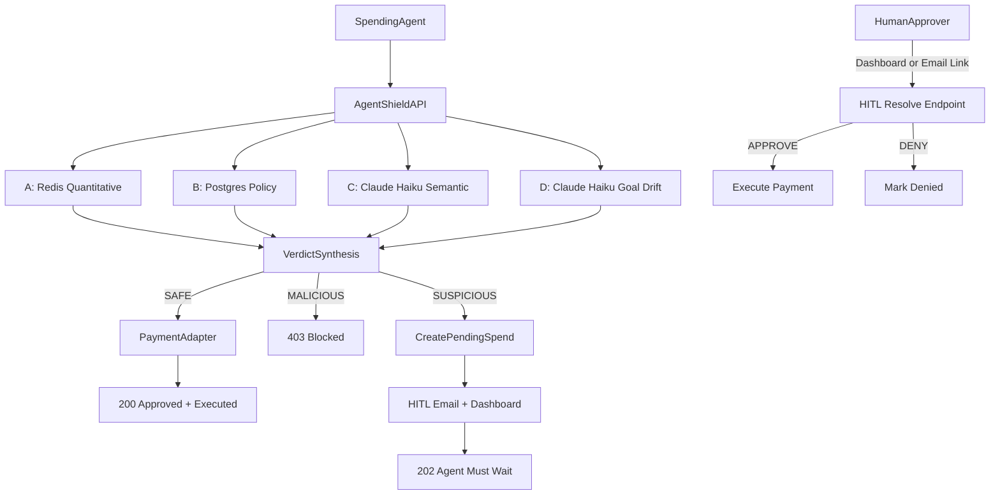

# AgentShield

A spending firewall for autonomous AI agents. Before an agent executes a payment, it submits a spend intent to AgentShield. Four independent risk checks run in parallel — Financial Triangulation — and AgentShield returns one of three verdicts: block the transaction, approve it immediately, or hold it for a human decision.

Built after a buying agent tried to make a bad purchase.

**SAFE** → execute immediately (`200`). **SUSPICIOUS** → pause for human review, agent waits (`202`). **MALICIOUS** → blocked (`403`).

Primary scope: **stablecoin spending** (`USDC`/`USDT`) with optional fiat adapter compatibility.

---

## How It Works

Every `POST /v1/spend-request` runs **Financial Triangulation** — four independent risk checks in parallel:

| Check | Engine | What It Catches |
|---|---|---|
| **A — Quantitative** | Redis | Daily budget overruns, transaction loop patterns, destination address burst |
| **B — Policy** | Postgres (Agent record) | Vendor blocklist, amount-over-threshold, stablecoin token/network/address policy, phishing domain rules |
| **C — Semantic** | Claude Haiku (Anthropic API) | Goal/vendor/item misalignment, suspicious domain classification |
| **D — Goal Drift** | Claude Haiku (Anthropic API) | Declared goal outside agent's configured allowed scopes |

Verdict synthesis: any hard-deny → `MALICIOUS`; any soft-risk → `SUSPICIOUS`; all clear → `SAFE`.



---

## Architecture & Design Decisions

**Budget reservation uses an atomic Lua script, not GET → compare → INCRBY.**
Two concurrent requests can both pass a non-atomic budget check before either increments the counter. `_CHECK_AND_RESERVE_BUDGET` in `quantitative.py` does the read, compare, and increment in a single Lua call so Redis executes it atomically.

**Budget key includes the date: `budget:daily:{agent_id}:{asset_type}:{YYYY-MM-DD}`.**
The date expires the key naturally — no cron, no DELETE. Each `asset_type` gets its own key, so stablecoin and fiat budgets are independent. SUSPICIOUS and MALICIOUS verdicts roll back the reservation; it only commits on a successful payment execution.

**Loop detection stores a fingerprint counter, not full transaction records.**
`SHA256(vendor|amount|item|asset_type|stablecoin|network|address)` → one counter per unique transaction shape, TTL = `LOOP_WINDOW_SECONDS`. Space is proportional to distinct fingerprints, not total transaction volume.

**Check B policy lives on the `Agent` row, not a separate table.**
Blocklists, thresholds, and stablecoin rules change infrequently. One primary-key read per request, no joins. Hard-deny rules (vendor blocklist, network allowlist) live in Postgres rather than Redis because a missed hard-deny is worse than a missed soft-risk — durability matters more than sub-ms latency here.

**The four checks run sequentially, not in parallel.**
`engine.py` runs A → B → C → D with sequential `await` calls. There is no `asyncio.gather()`. Check B is synchronous. The dominant latency is the two Claude API calls (C and D); parallelising them is a future optimisation.

**Check C falls back to `WEAK / risk_score=55` on Anthropic API failure, not a hard block.**
A WEAK result with `raw_score >= SEMANTIC_WEAK_SUSPICIOUS_MIN_SCORE` (default 50) routes to HITL. LLM downtime degrades to human review rather than blocking all transactions.

**Idempotency is opt-in, cached in Redis at 24-hour TTL.**
Without an `idempotency_key`, duplicate requests re-run all checks and can execute multiple payments. With one, the cached response is returned immediately on retry. Redis eviction means a re-run is possible — acceptable tradeoff over a Postgres fallback read on every request.

**Agent requests use HMAC-SHA256 rather than API keys or JWTs.**
API keys don't cover payload integrity. JWTs can't be revoked mid-window. The 5-line canonical message (method, path, timestamp, body hash, agent_id) gives payload tamper detection, replay prevention, and agent binding in one signature. Rotation is immediate — no grace period.

---

## Threat Model

**What it catches:**

| Threat | How |
|---|---|
| Agent sends funds to a blocklisted or disallowed vendor/address | Check B: substring blocklist, destination denylist/allowlist |
| Phishing vendor substitution | Check B: phishing domain heuristics; Check C: goal/vendor/item coherence |
| Goal/vendor misalignment (prompt injection, jailbreak) | Check C: semantic alignment label; MISMATCH → hard deny |
| Goal outside agent's intended purpose (scope creep) | Check D: declared goal vs. `allowed_scopes` |
| Repeated identical transactions (loop or retry storm) | Check A: fingerprint counter with TTL window |
| Budget overrun under concurrent load | Check A: atomic Lua budget reservation prevents TOCTOU |

**What it does not catch:**

| Gap | Why |
|---|---|
| Compromised operator | Valid Auth0 credentials can update policies, raise limits, and approve any HITL request |
| Redis unavailable | Check A raises a 500 — there is no fallback to SUSPICIOUS when Redis is unreachable |
| Adversarial semantic manipulation | A crafted `declared_goal` can produce `ALIGNED` from Claude Haiku; Checks C and D are LLM-based and share that attack surface |
| Post-execution compromise | AgentShield intercepts before payment; no rollback if the adapter is compromised after approval |

---

## Stack

**Backend:** Python 3.11+, FastAPI, SQLModel, Alembic, PostgreSQL, Redis, `uv`

**Semantic and goal-drift checks:** `claude-haiku-4-5-20251001` via Anthropic API

**HITL notifications:** SendGrid email (approve/deny links) + in-app dashboard queue

**Dashboard:** React + Vite + Tailwind, port 5173

**Auth:** Per-agent HMAC-SHA256 signed requests; Auth0 JWT for dashboard operators

---

## Local Development

### Prerequisites

- Python 3.11+
- Docker
- Node.js (for dashboard)

### Setup

1. Copy env template and fill in secrets:
   ```sh
   cp .env.example .env
   ```
   Required keys:
   - `ANTHROPIC_API_KEY` — Claude Haiku semantic and goal-drift checks
   - `SENDGRID_API_KEY` — HITL email notifications
   - `AGENT_HMAC_SECRET` — per-agent request signing
   - `WEBHOOK_HMAC_SECRET` — HITL resolve webhook signing
   - `API_PUBLIC_URL` — public base URL for email approve/deny links (use ngrok in dev)

2. Install Python dependencies:
   ```sh
   uv sync
   ```

3. Start infrastructure (Postgres + Redis):
   ```sh
   docker compose -f infra/docker-compose.yml up -d
   ```

4. Run database migrations:
   ```sh
   uv run alembic upgrade head
   ```

5. Start the API:
   ```sh
   uv run uvicorn app.main:app --reload --port 8000
   ```

6. Start the dashboard:
   ```sh
   cd dashboard && npm install && npm run dev
   ```
   Dashboard available at `http://localhost:5173`

### Environment Variables

```
APP_ENV=dev                                # dev | prod
POSTGRES_DSN=postgresql+psycopg://...
REDIS_DSN=redis://localhost:6379/0
ANTHROPIC_API_KEY=...                      # required for semantic check
ANTHROPIC_MODEL_NAME=claude-haiku-4-5-20251001
SENDGRID_API_KEY=...                       # required for HITL email
HITL_EMAIL_FROM=...
HITL_EMAIL_TO=...
API_PUBLIC_URL=http://localhost:8000       # ngrok tunnel in dev
AGENT_HMAC_SECRET=...
WEBHOOK_HMAC_SECRET=...
SIGNATURE_TOLERANCE_SECONDS=300
HITL_DEFAULT_TIMEOUT_SECONDS=600
AUTH0_DOMAIN=...                           # required for dashboard login
AUTH0_AUDIENCE=...
AUTH0_ISSUER=...
```

`APP_ENV=dev` relaxes some runtime guards. **Never deploy with `APP_ENV=dev`.**

---

## API Reference

### Endpoint Index

| Method | Path | Purpose |
|---|---|---|
| `POST` | `/v1/agents` | Register a new agent |
| `GET` | `/v1/agents` | List all agents |
| `POST` | `/v1/agents/{agent_id}/credentials/hmac/rotate` | Rotate HMAC secret |
| `PATCH` | `/v1/agents/{agent_id}/scopes` | Update allowed scopes for goal-drift detection |
| `POST` | `/v1/spend-request` | Submit a spend intent for evaluation |
| `GET` | `/v1/spend-request/{request_id}/status` | Poll status of a pending or resolved request |
| `POST` | `/v1/hitl/resolve/{request_id}` | Approve or deny a pending spend (dashboard/webhook) |
| `GET` | `/v1/hitl/email-resolve/{request_id}` | One-click approve/deny from email link |
| `GET` | `/v1/dashboard/agents/{agent_id}/notifications` | HITL queue (`?status=OPEN`) |
| `PATCH` | `/v1/dashboard/agents/{agent_id}/notifications/{notification_id}` | ACK or DISMISS a notification |
| `GET` | `/v1/dashboard/agents/{agent_id}/activity` | Full audit log with check results |
| `GET` | `/v1/dashboard/agents/{agent_id}/stats` | Daily transaction counts by outcome |
| `POST` | `/v1/onboarding/bootstrap` | One-shot agent setup with quickstart curl |
| `GET` | `/v1/onboarding/agents/{agent_id}/checklist` | Onboarding progress tracker |

---

### `POST /v1/spend-request`

Submits a spend intent for evaluation.

**Request:**

```json
{
  "agent_id": "agt_...",
  "declared_goal": "Book flight JFK to LAX",
  "amount_cents": 25000,
  "currency": "USD",
  "vendor_url_or_name": "delta.com",
  "item_description": "Economy seat JFK-LAX",
  "asset_type": "STABLECOIN",
  "stablecoin_symbol": "USDC",
  "network": "base",
  "destination_address": "0x...",
  "idempotency_key": "optional-dedup-key"
}
```

Stablecoin fields (`stablecoin_symbol`, `network`, `destination_address`) are required when `asset_type` is `STABLECOIN`. Supported networks: `ethereum`, `base`, `solana`, `polygon`, `arbitrum`.

**Responses:**

`200` — SAFE, payment executed:
```json
{
  "request_id": "req_...",
  "status": "APPROVED_EXECUTED",
  "verdict": "SAFE",
  "approved_amount_cents": 25000,
  "currency": "USD",
  "reasons": ["BUDGET_WITHIN_LIMIT", "VENDOR_ALLOWED", "SEMANTIC_ALIGNMENT_HIGH", "GOAL_WITHIN_SCOPE"]
}
```

`202` — SUSPICIOUS, pending human review:
```json
{
  "request_id": "req_...",
  "status": "PENDING_HITL",
  "verdict": "SUSPICIOUS",
  "hitl": {
    "state": "WAITING_HUMAN_REVIEW",
    "channel": "email+dashboard",
    "expires_at": "..."
  },
  "reasons": ["AMOUNT_OVER_AUTO_APPROVAL_THRESHOLD"],
  "next_action": "AGENT_MUST_WAIT"
}
```

`403` — MALICIOUS, blocked:
```json
{
  "request_id": "req_...",
  "status": "BLOCKED",
  "verdict": "MALICIOUS",
  "block_code": "POLICY_HARD_DENY",
  "reasons": ["VENDOR_MATCHED_BLOCKLIST"],
  "next_action": "DO_NOT_RETRY"
}
```

---

### `POST /v1/hitl/resolve/{request_id}`

Approve or deny a pending spend request.

```json
{
  "decision": "APPROVE",
  "resolver_id": "ops_user_1",
  "channel": "dashboard",
  "resolution_note": "Verified vendor"
}
```

---

### `GET /v1/hitl/email-resolve/{request_id}`

One-click approve/deny from the email link. Query params: `decision` (`APPROVE` or `DENY`), `token` (HMAC-signed for link authenticity). Returns a confirmation HTML page.

---

### `PATCH /v1/agents/{agent_id}/scopes`

Update the allowed scopes used by Check D (goal-drift detection). Requires dashboard operator authentication.

```json
{
  "allowed_scopes": ["travel booking", "hotel reservations", "ground transportation"]
}
```

When `allowed_scopes` is non-empty, every incoming spend request's `declared_goal` is evaluated against these scopes by Claude Haiku. Goals outside the defined scopes trigger a `SUSPICIOUS` verdict. When the list is empty, Check D skips and returns `GOAL_DRIFT_SKIPPED_NO_SCOPES`.

---

## Authentication

All auth logic lives in [app/core/security.py](app/core/security.py).

### Agent requests — HMAC-SHA256

The canonical message is 5 lines joined with `\n`:
```
METHOD
/v1/spend-request
<ISO8601 timestamp>
<SHA256 hex of raw request body>
<agent_id>
```

Sign it: `HMAC-SHA256(agent.hmac_secret, canonical_message)`. Send as headers:
- `x-agent-id: agt_...`
- `x-timestamp: 2026-04-25T12:34:56.789Z`
- `x-signature: sha256=<hex>`

The timestamp must be within ±`SIGNATURE_TOLERANCE_SECONDS` (default 300s) of the server clock. This prevents replay attacks. Body hashing prevents payload tampering.

**Python signing example:**
```python
import hashlib, hmac, json
from datetime import datetime, timezone

body = {"agent_id": AGENT_ID, "declared_goal": "...", ...}
body_json = json.dumps(body, separators=(",", ":"))
timestamp = datetime.now(timezone.utc).isoformat()
body_hash = hashlib.sha256(body_json.encode()).hexdigest()
canonical = "\n".join(["POST", "/v1/spend-request", timestamp, body_hash, AGENT_ID])
signature = hmac.new(AGENT_HMAC_SECRET.encode(), canonical.encode(), hashlib.sha256).hexdigest()
```

### HITL webhook — HMAC-SHA256

Same mechanics, but no `agent_id` line (4 lines instead of 5), and uses `WEBHOOK_HMAC_SECRET`. Headers: `x-webhook-timestamp` and `x-webhook-signature`.

### Dev bypass

`APP_ENV=dev` relaxes runtime guards (e.g., HITL webhook signature checking in tests). There is no header-based auth bypass in the current codebase — all production auth paths (HMAC or Auth0 Bearer) are always enforced by `verify_agent_auth`.

---

## Financial Triangulation Detail

### Check A — Quantitative (Redis)

```
Daily budget:
  key: budget:daily:{agent_id}:{asset_type}:{YYYY-MM-DD}
  → hard deny if (current + new) > daily_budget_limit_cents

Loop pattern detection:
  fingerprint = SHA256(vendor|amount|item|asset|symbol|network|address)
  key: loop:txn:{agent_id}:{fingerprint}  (TTL: LOOP_WINDOW_SECONDS)
  → suspicious if count >= LOOP_THRESHOLD (default 5)

Destination burst:
  key: dest:burst:{agent_id}:{network}:{address}  (TTL: LOOP_WINDOW_SECONDS)
  → suspicious if count >= 5
```

### Check B — Policy (Postgres)

```
Vendor blocklist        → hard deny if vendor substring-matches any blocked_vendors
Phishing domain rules   → hard deny on path parameter patterns / random-looking subdomains
Amount threshold        → suspicious if amount > hitl_required_over_cents (when set)
                          or per_txn_auto_approve_limit_cents (fallback)
Stablecoin rules:
  symbol not in allowed_stablecoins            → hard deny
  network not in allowed_networks              → hard deny
  address in blocked_destination_addresses     → hard deny
  address NOT in allowed_destination_addresses → suspicious (when list non-empty)
```

### Check C — Semantic (Claude Haiku)

Sends `declared_goal`, `amount_cents`, `vendor`, `item`, `stablecoin_symbol`, `network` to `claude-haiku-4-5-20251001`. Returns:

```json
{
  "alignment_label": "ALIGNED | WEAK | MISMATCH",
  "risk_score": 0-100,
  "reason_codes": ["..."]
}
```

Verdict mapping:
- `MISMATCH` label, or `raw_score >= 85` (promotes label to `MISMATCH`) → hard deny
- `WEAK` with `raw_score >= SEMANTIC_WEAK_SUSPICIOUS_MIN_SCORE` (default 50) → suspicious
- `WEAK` with `raw_score < 50` → pass (low-confidence weak signal, not flagged)
- `ALIGNED` → pass

The raw score from Claude is normalized to 0–100 before comparison (values in the 0–1 range are scaled up). If the Anthropic API is unavailable, the check falls back to `WEAK / risk_score=55` (suspicious, never hard block).

### Check D — Goal Drift (Claude Haiku)

Compares `declared_goal` against the agent's `allowed_scopes` list. Skips entirely when `allowed_scopes` is empty.

```json
{
  "within_scope": true,
  "matched_scope": "travel booking",
  "confidence": 92,
  "reason": "Goal matches the travel booking scope"
}
```

Verdict mapping:
- `within_scope: false` → suspicious (`GOAL_DRIFT_DETECTED`)
- `within_scope: true` → pass (`GOAL_WITHIN_SCOPE`)
- API unavailable → fail open, pass (does not block)

---

## Human-in-the-Loop (HITL)

When a request is `SUSPICIOUS`:

1. Status becomes `PENDING_HITL`, payment is **not** executed
2. Agent receives `202` with `next_action: AGENT_MUST_WAIT`
3. HITL notification sent via email (approve/deny links) and dashboard queue
4. Human approves or denies via the dashboard or email link within `HITL_DEFAULT_TIMEOUT_SECONDS` (default 10 min)
5. `APPROVE` → payment executes, audit log updated to `APPROVED_BY_HUMAN_EXECUTED`
6. `DENY` (or expiry) → request ends as `DENIED_BY_HUMAN` or `EXPIRED`, no payment

Agents poll `GET /v1/spend-request/{request_id}/status` to check resolution.

---

## Dashboard

The React dashboard (`dashboard/`) covers:

- **Agents** — register a new agent, view `agent_id` and HMAC secret, run dev test transactions
- **Overview** — stats cards (transactions today, blocked, pending, approved) + request activity chart
- **Activity** — full audit log with expandable Check A/B/C/D detail panel per transaction
- **Approvals** — live HITL queue with approve/deny buttons, SLM score bar, Redis/policy/goal-drift signals, countdown timer
- **Integration** — generated Python signing snippet pre-filled with your agent credentials
- **Settings** — HITL preferences (coming soon)

The dashboard auto-refreshes every 2 seconds. HMAC secrets are stored in `localStorage` keyed by `agent_id`.

---

## Data Models

### Postgres (SQLModel)

| Table | Purpose |
|---|---|
| `Agent` | Budget thresholds, blocked vendors, stablecoin policies, allowed scopes, HMAC secret |
| `SpendAuditLog` | Append-only ledger; every decision + HITL resolution updates status in place |
| `PendingSpend` | Paused requests awaiting human decision (expires in 10 min) |
| `DashboardNotification` | HITL queue items; states: `OPEN` → `ACKED` / `RESOLVED` / `DISMISSED` |
| `AgentActivity` | Structured event log per agent |
| `User` | Dashboard user accounts |

### Redis Keys

```
budget:daily:{agent_id}:{asset_type}:{YYYY-MM-DD}   → spent_cents, TTL until midnight
loop:txn:{agent_id}:{sha256_fingerprint}             → count, TTL 60s
dest:burst:{agent_id}:{network}:{address}            → count, TTL 60s
idempotency:{agent_id}:{idempotency_key}             → cached response JSON, TTL 24h
```

---

## Database Migrations (Alembic)

```sh
# Apply all migrations
uv run alembic upgrade head

# Show current revision
uv run python3 scripts/migrate.py current

# Create migration from model changes
uv run python3 scripts/migrate.py revision --autogenerate --message "your change"

# Roll back one revision
uv run python3 scripts/migrate.py downgrade -1
```

Migration files are in [app/migrations/versions/](app/migrations/versions/).

---

## Testing

```sh
uv run pytest
```

Test suite:

- **Unit** — policy check logic (`tests/unit/`)
- **Integration** — SAFE / SUSPICIOUS→APPROVE / MALICIOUS flows; dashboard queue list/ack behavior; HITL spend flow (`tests/integration/`)
- **E2E** — API contract shape tests (`tests/e2e/`)

---

## Security Notes

- HMAC signature replay protection via timestamp tolerance (`SIGNATURE_TOLERANCE_SECONDS`)
- Idempotency cache prevents duplicate payment execution on retried requests
- Budget committed only on successful payment execution — pending and denied transactions do not consume budget
- Vendor matching is substring-based (`"bad"` in blocklist matches `"badmarket.com"`)
- No HMAC rotation grace period — old secret is immediately invalid on rotation
- Request tracing middleware injects `x-request-id` and `x-latency-ms` on all responses
- In-process metrics counters in [app/core/metrics.py](app/core/metrics.py)
